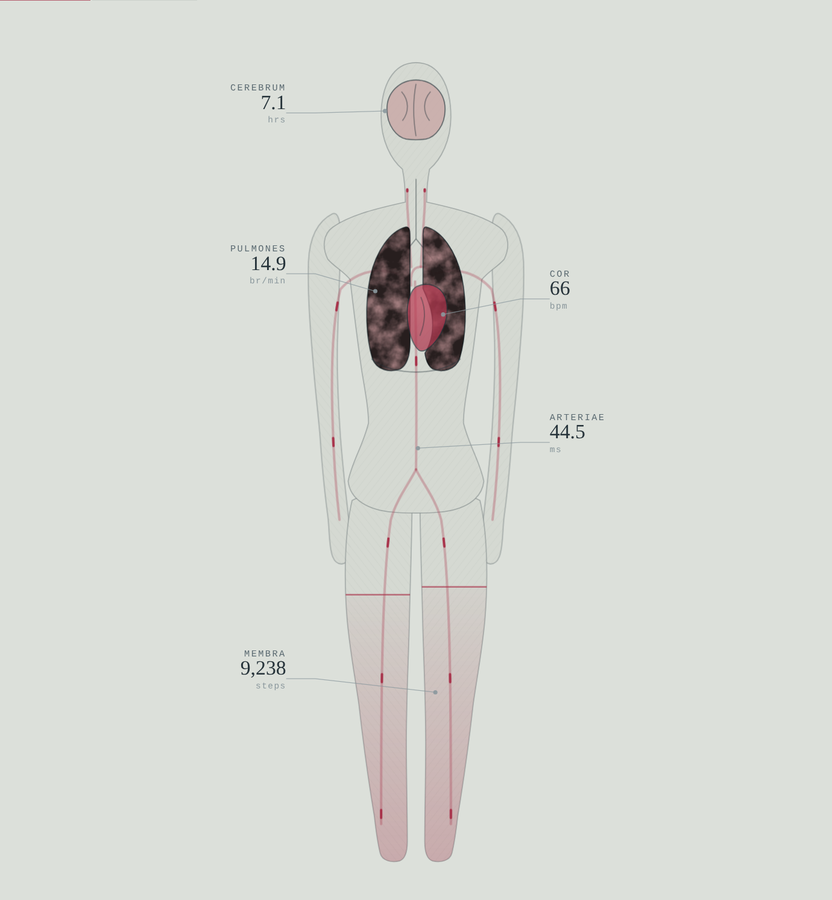
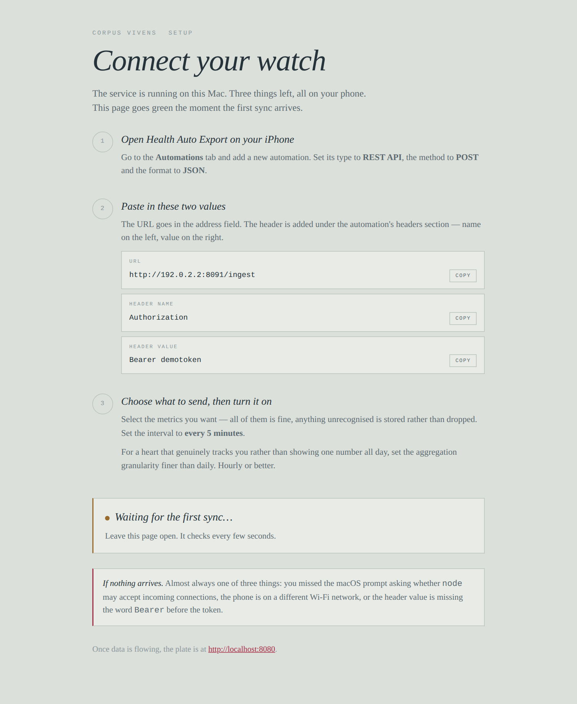
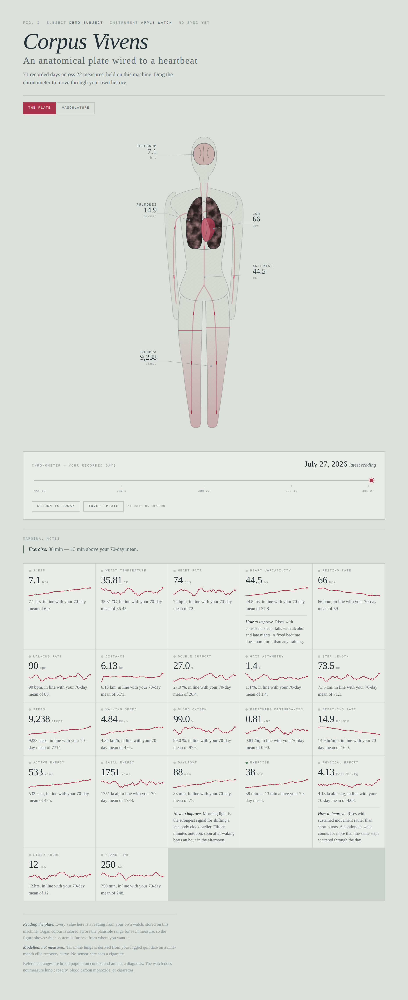
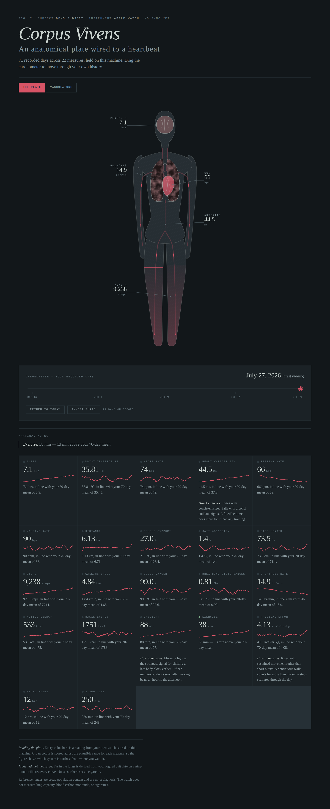
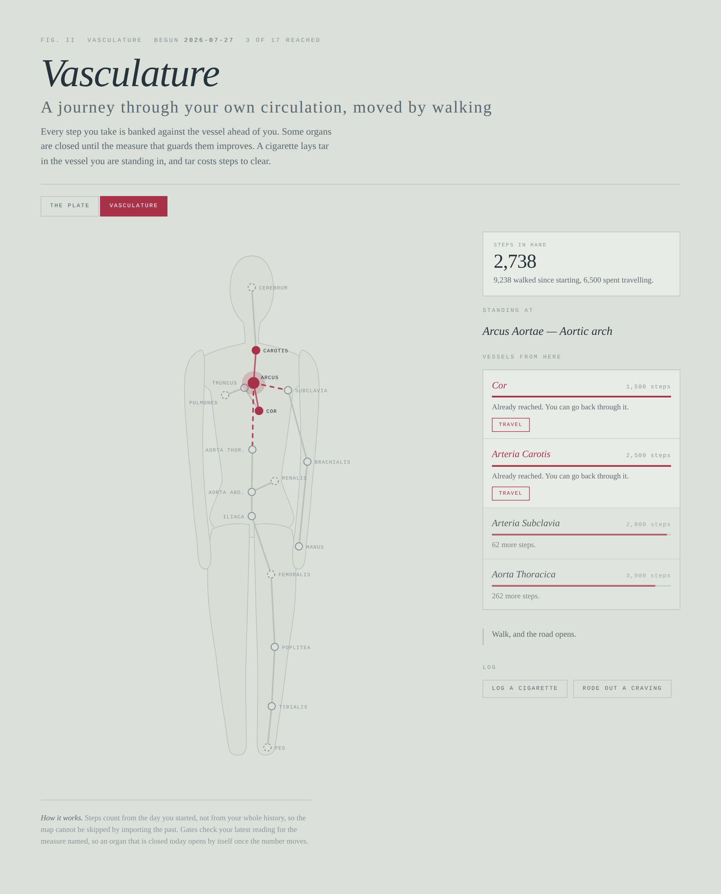

# Corpus Vivens

A private anatomical dashboard fed by Apple Health. An engraved plate of the
body where the heart beats at your measured rate, the lungs breathe at your
measured rate, and the legs fill with the distance you actually walked.

Everything runs on your own machine. No cloud account, no hosting bill,
nothing leaves your network.

<p align="center">
  
</p>

```
Apple Watch → iPhone → Health Auto Export → your Mac → SQLite → the plate
```

> Every screenshot in this README is generated from a synthetic demo dataset.
> No real health data is committed to this repository, and none should be.

## Requirements

- Node 22.5 or later (uses the built-in `node:sqlite`)
- [Health Auto Export](https://apps.apple.com/app/health-auto-export/id1115567069)
  on iPhone, with the REST API automation (a paid feature)
- No npm dependencies

## Setup

```bash
git clone https://github.com/pranayesse/health-app-dashboard.git
cd health-app-dashboard
./scripts/setup.sh
```

That checks your Node version, generates a token, writes `.env`, and starts
the service. Then open **http://localhost:8080/setup** on the Mac.

That page shows the exact URL and header to paste into Health Auto Export,
with copy buttons, and turns green the moment your phone's first sync
arrives. It also tells you what to check if nothing shows up.

<p align="center">
  
</p>

macOS will ask whether `node` may accept incoming connections. You have to
click **Allow**, or your phone cannot reach the service.

The setup page shows your ingest token, so it is only served to requests
coming from the Mac itself. Anyone else on your Wi-Fi loading that page gets
it without the secret.

<details>
<summary>Doing it by hand instead</summary>

```bash
cp .env.example .env
openssl rand -hex 32          # paste into INGEST_TOKEN in .env
npm start
```

In Health Auto Export, create an **Automation**:

- Type **REST API**, method **POST**, format **JSON**
- URL `http://<your-mac-ip>:8080/ingest`
- Header `Authorization: Bearer <your INGEST_TOKEN>`
- Interval every 5 minutes

Find your IP with `ipconfig getifaddr en0`.
</details>

Everything in the catalog is understood, and anything unrecognised is stored
rather than dropped. For a heart that tracks you through the day rather than
showing one number, set the aggregation granularity finer than daily — the
schema already handles intraday points.

### Seed some history

The live feed starts empty, and a body with no memory can't tell you what is
unusual *for you*. Two ways to fill it:

```bash
# from saved Health Auto Export JSON files
npm run import -- ~/Downloads/HealthAutoExport-*.json

# or generate plausible history anchored on your real values,
# to see how the plate behaves before you have months of data
npm run seed 60
```

Synthetic rows are tagged `source = 'synthetic'`. Remove them with
`DELETE FROM readings WHERE source = 'synthetic';`

## What the plate shows

<p align="center">
  
</p>

The chronometer sits directly under the figure — drag it to redraw the body as
it was on any recorded day. Marginal notes appear only for genuine outliers,
and metric tiles carry improvement guidance where there is room to improve.

<p align="center">
  
</p>

| Part of the figure | Driven by |
|---|---|
| Heart, beat rate | `resting_heart_rate` |
| Heart, opacity | `heart_rate_variability` |
| Lungs, breathing rate | `respiratory_rate` |
| Lungs, tissue colour | `blood_oxygen_saturation` |
| Brain, clarity | `sleep_analysis` |
| Legs, charge level | `step_count` |
| Legs, left/right difference | `walking_asymmetry_percentage` |

Organ colour is scored across each measure's full plausible range rather
than against an ideal band. Scoring against the ideal pins every
out-of-range value to zero and renders a uniformly dead body, which tells
you nothing about which system to work on first.

### What it does not show

The watch does not measure lung capacity, blood carbon monoxide, or
cigarettes. Those were in the original sketch and have been removed rather
than faked. Tar in the lungs is the one modelled value that remains — it is
derived from a `QUIT_DATE` you set by hand, on a nine-month cilia recovery
curve, and it is labelled as modelled everywhere it appears.

If you want a real number there, a CO breathalyser costs about £25 and reads
in ppm. Log it and the panel becomes measurement rather than inference.

## Vasculature

<p align="center">
  
</p>

A second page at `/game`. You start at the heart and walk your way through your
own circulatory system — steps bank against the vessel ahead of you, and the
map is the same figure the plate draws.

- **Steps count from the day you start**, not from your history, so the map
  can't be skipped by importing the past.
- **Some organs are gated on a measure**, not on distance. The brain opens at
  seven hours of sleep, the renal artery at a resting rate of 82 or below, the
  foot at an HRV of 30. Those thresholds sit just beyond a sedentary starting
  point — each is a nudge, not a wall, and a closed organ opens by itself once
  the number moves.
- **A logged cigarette lays tar** in the vessel you're standing in, which costs
  2,500 steps to clear.
- Reaching an organ unlocks it. The full map is about 73,000 steps.

Travel and event logging are accepted from loopback without a token, so the
browser on your Mac can drive them. Ingest stays strict.

## How to improve

Every metric carries concrete guidance, shown on its tile only when there's
room to improve — advice attached to something already going well is how a
page turns into wallpaper.

## Marginal notes

Once there are at least 7 days on record, the plate stops using population
reference ranges and starts judging every value against your own rolling
90-day baseline. Anything more than two standard deviations out earns a note
in the margin. A plate that comments on everything is a plate you stop
reading, so only genuine outliers qualify.

## Running it permanently

```bash
cp scripts/com.corpusvivens.server.plist ~/Library/LaunchAgents/
# edit the paths and token inside first
launchctl load ~/Library/LaunchAgents/com.corpusvivens.server.plist
```

The Mac has to be awake to receive. Gaps are recoverable: re-sync the date
range from Health Auto Export, or export those days and `npm run import`.

Off your home network the plate is unreachable, which is the intended
behaviour. If you want it on your phone while out, Tailscale's personal tier
tunnels it without exposing anything publicly.

## API

| Route | |
|---|---|
| `POST /ingest` | Health Auto Export posts here. Bearer token required. |
| `POST /event` | Log `cigarette`, `craving`, or `quit`. Bearer token required. |
| `GET /api/plate` | Everything the figure needs, in one call. |
| `GET /api/metric/:name` | One metric, with optional `?day=YYYY-MM-DD` intraday points. |
| `GET /api/health` | Liveness and last-ingest time. |
| `GET /api/game` | Vasculature state: position, routes, gates, steps banked. |
| `POST /api/game/travel` | Move to an adjacent vessel. |
| `GET /api/setup` | Connection details. The token is served to loopback only. |

## Privacy

`.gitignore` excludes the database, `.env`, and any Health export files. Keep
it that way — none of this belongs in a repository. The ingest route requires
a bearer token because anyone on your Wi-Fi could otherwise write to your
health record. Set `HOST=127.0.0.1` to lock it to this machine, though your
phone will then be unable to reach it.

## Tests

```bash
npm test
```

Covers the normalizer, which is where the format quirks live: dates like
`2026-07-27 00:00:00 +0530`, `heart_rate` carrying `Avg`/`Min`/`Max` instead
of `qty`, and `sleep_analysis` arriving as a whole object.

## Notes on the data

Readings are keyed on `(metric, timestamp)`, so re-posting a day updates it
rather than duplicating. That also means switching Health Auto Export to
finer than daily granularity just starts producing more rows — no migration.

Reference ranges here are broad population context, not a diagnosis.
